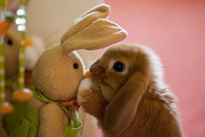
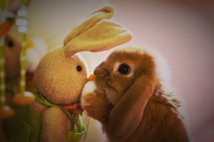

# Instagram effects using SVG filters

Port of some of the Instagram photo filters to pure-SVG/HTML (no Javascript, therefore hardware accelerated).

Filter | Output
-------|-------
None | 
Brannan | 
EarlyBird | 
Inkwell | 
Lo-Fi | 
Mayfair | 
Nashville | 
