# Instagram effects using SVG filters

Port of some of the Instagram photo filters to pure-SVG/HTML (no Javascript, therefore hardware accelerated).

## brannan

## earlybird

## inkwell

## lo-fi

## mayfair

## nashville

